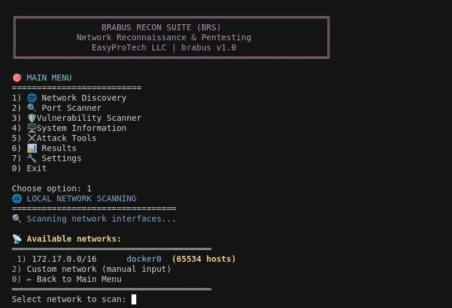
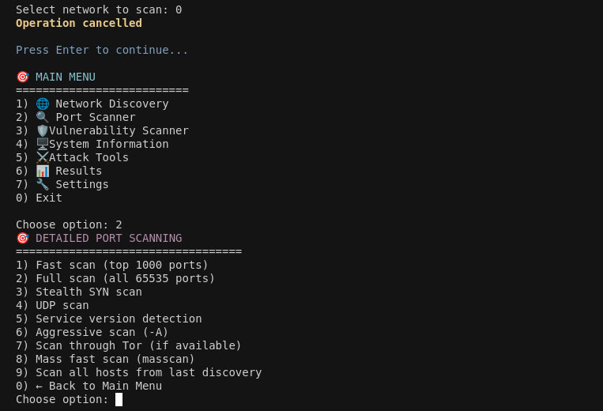
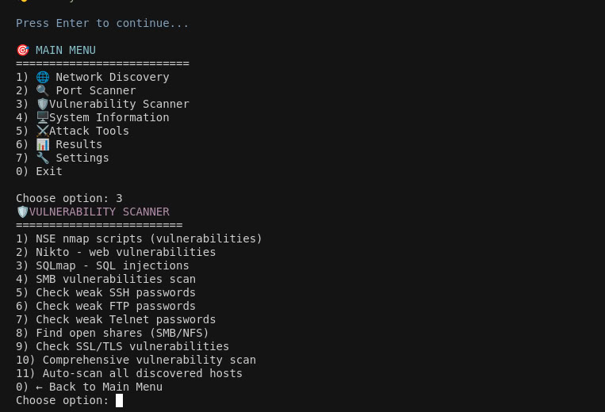
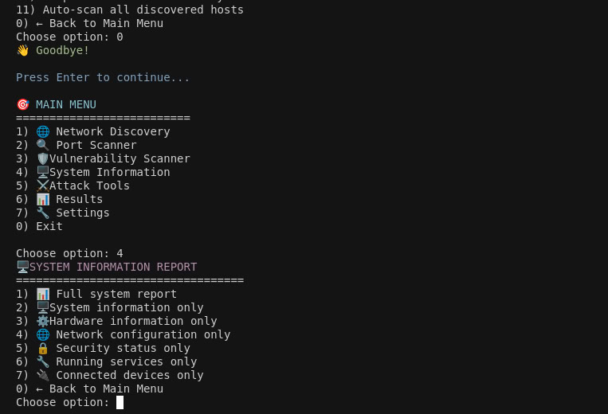
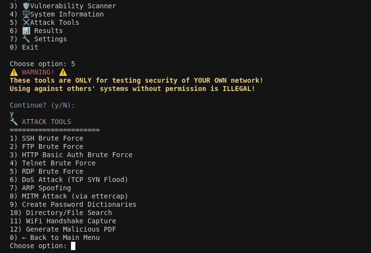
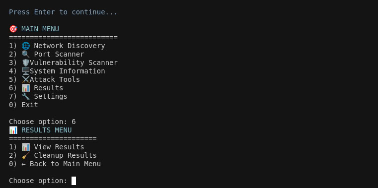
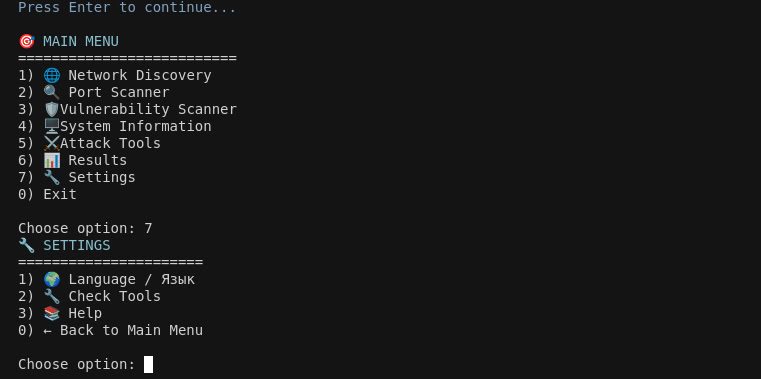

```
██████  ██████  ███████ 
██   ██ ██   ██ ██      
██████  ██████  ███████ 
██   ██ ██   ██      ██ 
██████  ██   ██ ███████ 
```

# 🔧 Brabus Recon Suite (BRS)

**Professional Network Reconnaissance & Penetration Testing Toolkit**

*by EasyProTech LLC (www.easypro.tech)*

Powerful suite of tools for network reconnaissance, vulnerability assessment and penetration testing of local networks.

## 🚨 CRITICAL LEGAL WARNING

**⚠️ UNAUTHORIZED USE IS ILLEGAL AND MAY RESULT IN CRIMINAL PROSECUTION ⚠️**

**THIS IS A PENETRATION TESTING TOOLKIT FOR AUTHORIZED SECURITY TESTING ONLY**

Using this software to scan, probe, or attack networks, systems, or services that you do not own or have explicit written permission to test is **ILLEGAL** and may result in:

- **Criminal charges** and prosecution under computer crime laws (CFAA, etc.)
- **Substantial fines** (potentially millions of dollars depending on jurisdiction)
- **Prison time** (multiple years depending on severity and jurisdiction)
- **Permanent criminal record** affecting future employment and travel opportunities
- **Civil lawsuits** for damages, business disruption, and legal costs

**AUTHORIZED USE ONLY:**
- Your own networks and systems
- With explicit written authorization from system owners
- Within scope of authorized penetration testing contracts
- As part of legitimate bug bounty programs
- In controlled educational environments with proper supervision

**COMPLETE DISCLAIMER OF LIABILITY:**
EasyProTech LLC, its officers, employees, and contributors provide this software "AS IS" with NO WARRANTY and are NOT RESPONSIBLE for any damage, harm, legal consequences, or misuse. Users accept FULL RESPONSIBILITY and agree to indemnify EasyProTech LLC.

**READ BEFORE USE:** See LEGAL.md, ETHICS.md, and DISCLAIMER.md for complete terms.

## 📦 Installation

```bash
git clone https://github.com/EasyProTech/brs.git && cd brs && ./main.sh
```

## 🚀 Quick Start

```bash
# Clone or extract the project to any directory
cd brs
./main.sh
```

The toolkit works from any directory - all paths are automatically resolved relative to the project location.

## 📸 Screenshots

### 🌐 Network Discovery


### 🔍 Port Scanner


### 🛡️ Vulnerability Scanner


### 🖥️ System Information


### ⚔️ Attack Tools


### 📊 Results & Settings



## 📁 Project Structure

```
brs/
├── main.sh                    # Main control script
├── scripts/                   # Executable modules
│   ├── network_discovery.sh   # Network reconnaissance
│   ├── port_scanner.sh        # Port scanning
│   ├── vulnerability_scanner.sh # Vulnerability assessment
│   ├── system_info.sh         # System information gathering
│   └── attack_tools.sh        # Penetration testing tools
├── results/                   # Auto-generated scan results
├── wordlists/                 # Password dictionaries
├── configs/                   # Configuration files
├── languages/                 # Localization files (en/ru/de/fr/es/zh/tr)
├── tools/                     # Additional tools
└── README.md                  # This documentation
```

## 🎯 Core Modules

### 1. 🌐 Network Discovery
**Discover devices in local networks**

- Automatic network range detection
- Ping sweep scanning
- ARP scanning for hidden devices
- Quick port scanning of found hosts
- Live hosts list saving

### 2. 🔍 Port Scanner
**Detailed port scanning**

**Scanning modes:**
- Quick (top 1000 ports)
- Full (all 65535 ports)
- Stealth SYN scanning
- UDP scanning
- Service version detection
- Aggressive scanning (-A)
- Tor scanning
- Mass scanning (masscan)

### 3. 🛡️ Vulnerability Scanner
**Security vulnerabilities detection**

**Check types:**
- NSE nmap scripts for vulnerabilities
- Nikto for web vulnerabilities
- SQLmap for SQL injections
- SMB vulnerabilities (EternalBlue, MS08-067)
- Weak passwords checking (SSH, FTP, Telnet)
- Open network resources discovery
- SSL/TLS vulnerabilities
- Comprehensive scanning

### 4. 🖥️ System Information
**Comprehensive system reconnaissance**

**Information gathering:**
- System details (OS, kernel, architecture, uptime)
- Hardware information (CPU, memory, disk usage)
- Network configuration (interfaces, connections, routing)
- Security status (firewall, SSH, fail2ban, SELinux)
- Running services and failed services
- Connected devices (USB, PCI, WiFi, Bluetooth)

### 5. ⚔️ Attack Tools
**Active penetration testing tools**

**⚠️ AUTHORIZED TESTING ONLY!**

**Brute force attacks:**
- SSH, FTP, HTTP Basic Auth
- Telnet, RDP brute force
- Custom wordlists support

**Network attacks:**
- DoS attacks (TCP SYN Flood)
- ARP Spoofing
- MITM attacks via ettercap
- Directory bruteforcing

**Specialized attacks:**
- WiFi attacks (handshake capture, deauth)
- Malicious file generation

## 🛠️ Required Tools

The toolkit uses standard penetration testing tools:
- **nmap** - port and service scanning
- **masscan** - fast port scanning
- **hydra** - brute force attacks
- **nikto** - web vulnerability scanning
- **sqlmap** - SQL injection testing
- **john** - password cracking
- **ettercap** - MITM attacks
- **aircrack-ng** - WiFi auditing
- **wireshark** - traffic analysis

## 📊 Results

All results are automatically saved in the `results/` directory with timestamps:

```
results/
├── live_hosts_20241229_143021.txt
├── network_scan_20241229_143045.txt
├── vuln_scan_192.168.1.1_20241229_143102.txt
└── ssh_attack_192.168.1.100_20241229_143205.txt
```

## 🔧 Configuration

### System Requirements
- Ubuntu 22.04+ or similar Linux distribution
- Sudo privileges (configured without password prompt)
- Minimum 2GB free space
- Network interfaces for WiFi attacks (if needed)

### Language Support
- 🇺🇸 English (en)
- 🇷🇺 Russian (ru)
- 🇩🇪 German (de)
- 🇫🇷 French (fr)
- 🇪🇸 Spanish (es)
- 🇨🇳 Chinese Simplified (zh)
- 🇹🇷 Turkish (tr)
- Auto-detection based on system locale
- Configuration in `configs/language.conf`

## 🚨 Security Guidelines

1. **Use only on your own networks**
2. **Get written permission** before testing external systems
3. **Do not run DoS attacks** on critical systems
4. **Follow local laws and regulations**
5. **Document all activities** for reporting

## 📈 Typical Workflow

1. **Network reconnaissance:**
   ```bash
   ./main.sh → 1) Network Discovery
   ```

2. **Detailed scanning:**
   ```bash
   ./main.sh → 2) Port Scanner → 9) Scan all hosts
   ```

3. **Vulnerability assessment:**
   ```bash
   ./main.sh → 3) Vulnerability Scanner → 11) Auto-scan
   ```

4. **Active testing:**
   ```bash
   ./main.sh → 4) Attack Tools → select specific attack
   ```

5. **Results analysis:**
   ```bash
   ./main.sh → 6) Results
   ```

## 🔍 Usage Examples

### Quick network scan
```bash
# Automatic discovery and scanning
./main.sh
# Select option 1 (Network Discovery)
```

### Detailed host scanning
```bash
# For specific target
nmap -A -T4 192.168.1.100
```

### SMB vulnerability check
```bash
nmap --script smb-vuln* -p445 192.168.1.0/24
```

### SSH brute force
```bash
hydra -L wordlists/common_users.txt -P wordlists/common_passwords.txt 192.168.1.100 ssh
```

## 🆘 Troubleshooting

If you encounter issues:

1. Check file permissions (`chmod +x *.sh`)
2. Ensure all dependencies are installed
3. Verify network settings
4. Review logs in `results/` directory
5. Check sudo configuration

## 📚 Additional Resources

- [Nmap Documentation](https://nmap.org/docs.html)
- [Hydra Manual](https://github.com/vanhauser-thc/thc-hydra)
- [Nikto Documentation](https://cirt.net/Nikto2)
- [SQLmap User Manual](https://sqlmap.org/)

**Remember: With great power comes great responsibility!**

*Use these tools ethically and within legal boundaries.*

## ⚖️ LEGAL DISCLAIMER AND USER AGREEMENT

**🚨 CRITICAL: READ CAREFULLY BEFORE DOWNLOADING OR USING**

**BY DOWNLOADING, INSTALLING, OR USING THIS SOFTWARE, YOU ACKNOWLEDGE THAT YOU HAVE READ, UNDERSTOOD, AND AGREE TO BE LEGALLY BOUND BY ALL TERMS AND CONDITIONS.**

### AUTHORIZED USERS ONLY:
- ✅ **Cybersecurity professionals** with explicit written authorization
- ✅ **Penetration testers** working under signed contracts
- ✅ **System administrators** testing their own infrastructure
- ✅ **Bug bounty hunters** within program scope and rules
- ✅ **Security researchers** on owned/authorized systems only
- ✅ **Students** in controlled educational environments with supervision

### ABSOLUTELY PROHIBITED:
- ❌ **Unauthorized scanning** of any networks or systems
- ❌ **Unauthorized penetration testing** (even "harmless" reconnaissance)
- ❌ **Corporate espionage** or competitive intelligence gathering
- ❌ **Personal attacks** or vendettas against individuals/organizations
- ❌ **Proof-of-concept attacks** on others' systems
- ❌ **Any illegal activities** under local, national, or international law

### LEGAL CONSEQUENCES OF MISUSE:
Unauthorized use may result in prosecution under:
- **United States**: Computer Fraud and Abuse Act (18 U.S.C. § 1030)
- **European Union**: Directive 2013/40/EU on attacks against information systems
- **United Kingdom**: Computer Misuse Act 1990
- **Russian Federation**: Criminal Code Articles 272-274 (computer crimes)
- **People's Republic of China**: Criminal Law Articles 285-287, Cybersecurity Law
- **International**: Council of Europe Convention on Cybercrime
- **Plus applicable state, provincial, and national laws worldwide**

### YOUR LEGAL OBLIGATIONS:
By using this software, you declare under penalty of perjury that:
1. **You own the target systems** OR have explicit written authorization
2. **You understand applicable laws** in your jurisdiction
3. **You accept full legal responsibility** for your actions and their consequences
4. **You will indemnify and hold harmless** EasyProTech LLC from any claims
5. **You will cease use immediately** if authorization is revoked

### COMPLETE DISCLAIMER OF LIABILITY:
**EASYPROTECH LLC, ITS OFFICERS, DIRECTORS, EMPLOYEES, AND CONTRIBUTORS:**
- Provide this software "AS IS" with **NO WARRANTY** of any kind
- Are **NOT RESPONSIBLE** for any damage, harm, or legal consequences
- **EXPRESSLY DISCLAIM** all liability for misuse of this software
- **MAXIMUM LIABILITY** for any claim shall not exceed $1.00

**YOU USE THIS SOFTWARE AT YOUR OWN RISK AND BEAR FULL RESPONSIBILITY.**

### INDEMNIFICATION:
You agree to **INDEMNIFY, DEFEND, AND HOLD HARMLESS** EasyProTech LLC and its affiliates from any claims, damages, losses, liabilities, costs, or expenses (including attorney's fees) arising from your use or misuse of this software.

### REPORTING MISUSE:
If you become aware of misuse of this software, report it immediately to:
- Local law enforcement agencies
- Relevant cybersecurity authorities (FSB, MVD for Russian Federation)
- Software maintainers via @easyprotechaifactory (Telegram)

### COOPERATION WITH AUTHORITIES:
EasyProTech LLC is ready for full cooperation with law enforcement agencies of the Russian Federation in identifying and prosecuting those who use this software unethically.

---

**⚠️ FINAL WARNING: If you cannot make the required legal declarations above, DO NOT USE THIS SOFTWARE. When in doubt, consult with qualified legal counsel familiar with cybersecurity law.**

**The goal of security testing is to improve security, not cause harm. Use responsibly or face serious legal consequences.**

## 📞 Support

I do not provide support. I do not consult — not for free, not for money, not in any form.

Please don't ask for help, fixes, or explanations — this project is released as-is.

If someone wants to help with development — contributions are welcome. But there are no obligations from my side whatsoever.

## 📜 License

**DUAL LICENSE STRUCTURE** – Enhanced Legal Protection

This software is available under **TWO LICENSE OPTIONS**:

### 🆓 GPLv3 License (Open Source)
- **For**: Educational, research, personal, and open-source projects
- **Requirements**: Copyleft compliance, source code disclosure for derivatives
- **Default**: Applies automatically if no commercial license obtained

### 💼 Commercial License
- **For**: Commercial entities, proprietary projects, closed-source derivatives  
- **Benefits**: No copyleft requirements, proprietary use allowed
- **Contact**: @easyprotechaifactory (Telegram)

**GPLv3 provides stronger legal protection than MIT** through:
- Copyleft enforcement preventing unauthorized commercialization
- Enhanced attribution requirements
- Automatic license termination for violations
- International legal framework recognition

**See LICENSE file for complete dual-license terms.**

---

**Released by EasyProTech LLC | Lead Developer: brabus | Licensed under GPLv3 + Commercial | @easyprotechaifactory** 